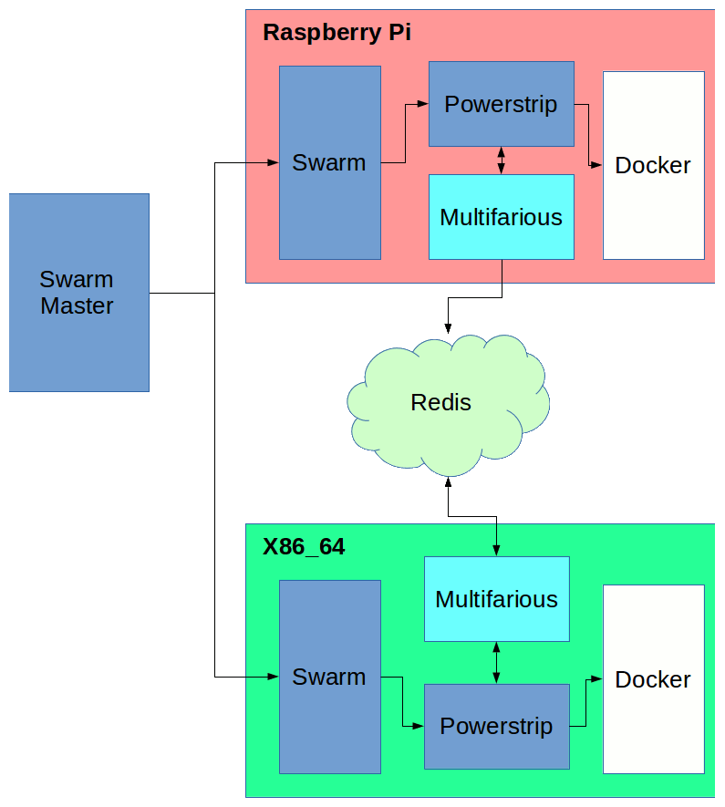

# Multifarious
## Heterogenous Docker Swarms

**Note:** As of April 2015, Docker only supports X86_64 architectures. This project, therefore, seeks to subvert the dominant paradigm.

### Warnings and Disclaimers

**Warning:** Powerstrip exposes the Docker API unprotected on port 2375. Only use it in private, secure development environments.

**Note:** Docker is not supported on any other architecture other than X86_64 or AMD64. Any use of Docker on any other platform is not guaranteed to work.  Furthermore the number of containers on the Docker Hub for use with other platforms are extremely limited.

#### Anti-Disclaimer

The author of [Multifarious](http://github.com/nimblestratus/multifarious) has successfully used [Docker](http://docker.com) on the Raspberry Pi, including Docker Swarm and other containers. It is true that there are not many containers available, but it is usually pretty straightforward to port containers.

## Introduction

This project seeks to provide a means for building heterogenous swarms of Docker hosts, such as X86_64 and Raspberry Pi working together in a swarm.

The first iteration is a quick proof of concept to verify that it works.  Subsequent iterations will replace individual pieces to make it more efficient.

## Architecture

Multifarious inserts itself into the Swarm chain between the Swarm client and the Docker daemon.

Multifarious implements [dependency injection](http://en.wikipedia.org/wiki/Dependency_injection) for Docker containers. It is used to choose the proper container version for an architecture.

**Example:** A heterogenous swarm consists of Raspberry Pis and X86_64 hosts. A web server is to be run in the swarm. The request is submitted to the Swarm Master, which decides on which host to run the instance. The Master sends the request to the client, which passes the request to Powerstrip/Multifarious. Multifarious determines whether an architecture specific container has been registered for the container name. Multifarious injects the name of the container and the message is sent to the Docker Daemon which then starts the web server.

